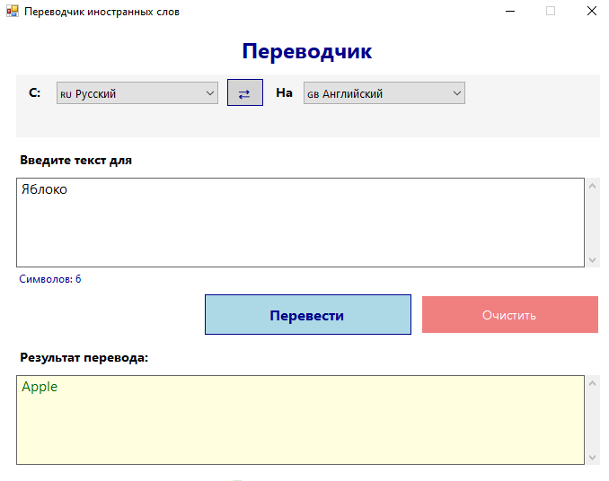

# TranslatorApp — переводчик иностранных слов

## Описание проекта

Простое приложение для перевода текста между четырьмя языками с использованием внешнего API. Этот проект показывает, как работать с REST API и создавать графический интерфейс на Windows Forms в C#.

## Стек технологий

*   **Язык:** C# (.NET 6.0)
*   **Интерфейс:** Windows Forms (WinForms)
*   **API:** MyMemory Translation API (бесплатный, без ключа)
*   **Система контроля версий:** Git, GitHub

## Функционал

*   Перевод текста между 🇷🇺 Русским, 🇬🇧 Английским, 🇩🇪 Немецким и 🇫🇷 Французским языками.
*   Удобный графический интерфейс с выбором языка "С" и "На".
*   Кнопка для быстрой смены языков местами (⇄).
*   Отображение статуса загрузки и понятные сообщения об ошибках.
*   Все переводы получаются из внешнего REST API.

## Скриншоты

## Автор

Egor Luchshev
Группа: 1251

## Дата

Июнь 2026
